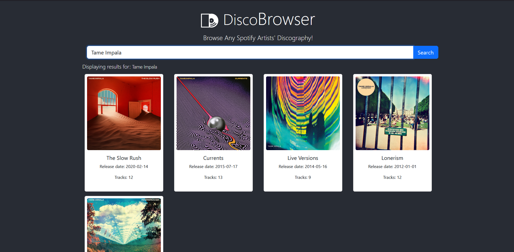

# DiscographyBrowser

DiscoBrowser is a React.js application that interfaces with the Spotify API to allow users
to search for an artist and view their albums. Key functionalities include:
- **Authentication**
  - Client credentials stored in a secure .env file are read into the React application,
    which then utilizes them to authenticate with the Spotify API, fetching an access
    token for further requests.
- **Searching for an artist**
  - Users can input an artist's name in a search bar, and the application fetches the
    artist's ID.
- **Displaying albums**
  - Once the artist's ID is retrieved, the application fetches all the albums related to
    that artist and displays them in a grid format using Bootstrap cards.
  - Within the card, the album artwork is displayed, as well as the album’s title, # of
    tracks, and release date.
- **Navigation to Spotify**
  - Upon clicking on the album’s artwork (per Spotify’s Developer agreement
    mandate), the user is brought to the Spotify page for that album.

## Dev Process

This project was developed using Visual Studio Code as the code editor. The application
utilizes Node Project Manager, as well as React.js, React hooks (useState, useEffect),
React-bootstrap components, and Bootstrap CSS. All Spotify API calls were written manually,
without the use of wrapper libraries.

## Testing

While I wish I could say that I followed best-practices and used a unit testing
suite such as Jest, that simply was not the case. This project had significant time constraints, and
thus testing was limited to manual tests with console logging. Errors are handled via console
logs, as well as catch blocks around any fetch operations that eliminate main failure points.
